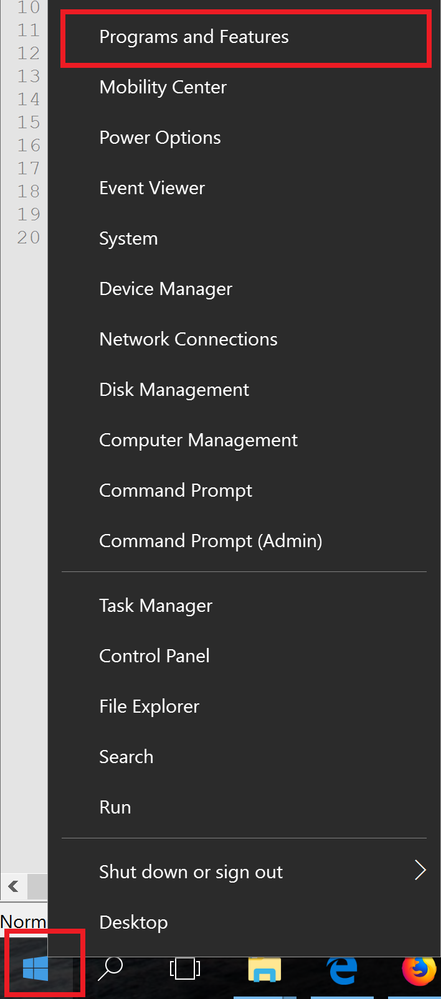
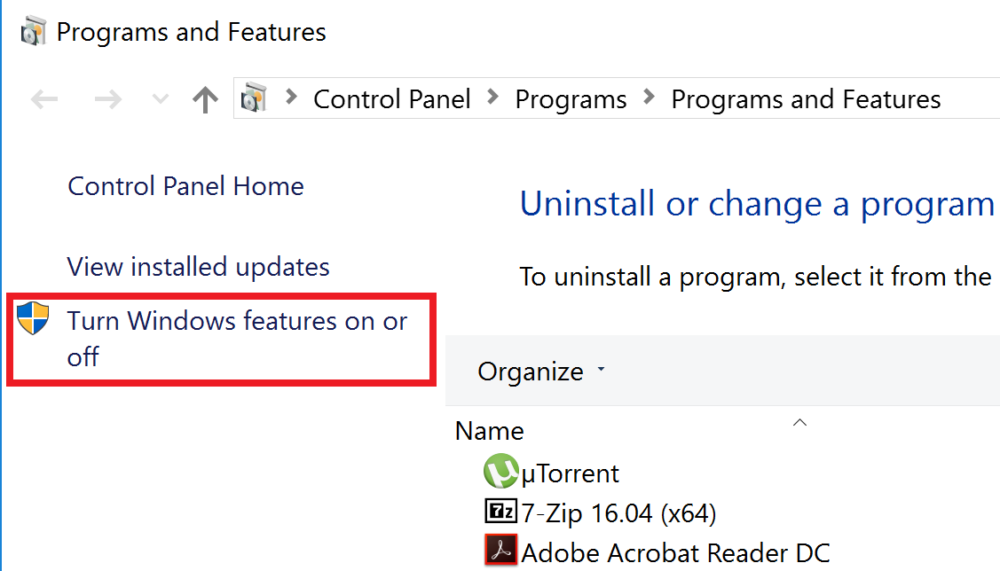
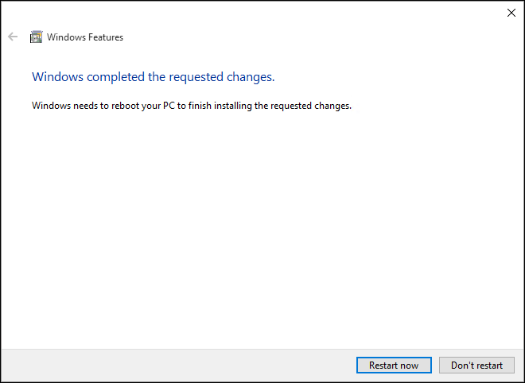

Installation
************
The BTS-CE application is distributed in Docker containers to simplify the installation. Docker is a way to distribute self-contained applications easily. We provide Docker images for the Community Edition that you can very easily install and upgrade on your PC, Laptops, or server. The docker hub repositories are located at https://hub.docker.com/u/bodastage/

Although this is the recommended installation method, you can still download the individual components from the Bodastage Solutions github page and install them as your see fit.

Requirements
============
To run BTS-CE Docker containers, you will need:

* A 64 bit operating system. (Windows 10, Linux, MacOSX)

* Atleast 10 GB disk space

* Atleast 4 GB RAM

Windows  
=======

1. Enable HyperV or install Oracle VirtualBox 

2. Download and install Docker Community Edition rom https://www.docker.com/community-edition#/download.

3. Download the latest release files for BTS-CE from https://github.com/bodastage/bts-ce/releases

4. Unzip the BTS-CE realease files. Open **cmd** as an Administrator and run **manager.bat up -d**

5. Access the web client at localhost or <docker-machine ip> for Windows users

Enable HyperV or Install Oracle VirtualBox 
------------------------------------------

When installing Docker CE on Windows,yYou can either use Hyper-V or Oracle VirtualBox.  These are used to create virtual machines from which your containers will run. 

HyperV is an optional feature available on Windows 10 Enterprise, Professional, or Education. If you are using Windows 10 Home or any other windows release, you will need to upgrade or use Oracle VirtualBox.

To manually enable the Hyper-V role:

1. Right click on the Windows button and select '**Programs and Features**'.

2. Click **Turn Windows Features on or off**.

3. Select **Hyper-V** and click **OK**. 

.. image:: images/enable_role_hyperv.png

When the installation has completed you are prompted to restart your computer

Incase hyper-v is not available, download Oracle VirtualBox from https://www.virtualbox.org/

.. Add note on which windows build versions are supported 

Download and install Docker Community Edition 
---------------------------------------------
Get the download from https://www.docker.com/community-edition#/download. 

Download the latest release files for BTS-CE 
--------------------------------------------
Download the latest release files from from https://github.com/bodastage/bts-ce/releases.

We recommed that you place the files in **C:/Bodastage/bts-ce** 

Lunix and MacOSX
================

Follow the steps below to install the application:

1. Download Docker Community Edition for your platform from https://www.docker.com/community-edition#/download. 

2. Download the latest release files for BTS-CE from https://github.com/bodastage/bts-ce/releases

3. Unzip the zip file in 2) to your desired location

4. Make bts.sh and create_folders.sh executable
.. code-block:: sh
   chmod +x bts.sh create_folders.sh

5. Run **./bts.sh setup**

6. Access the web client at http:://localhost:8888