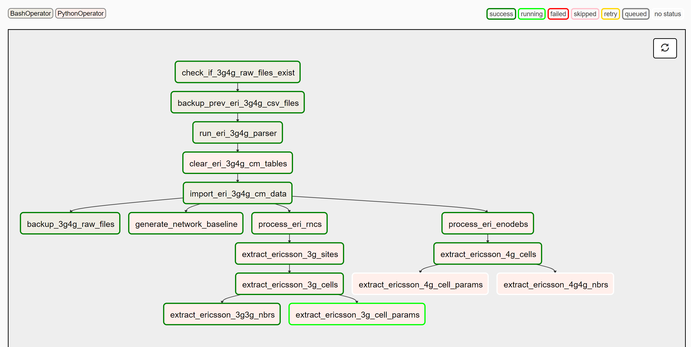
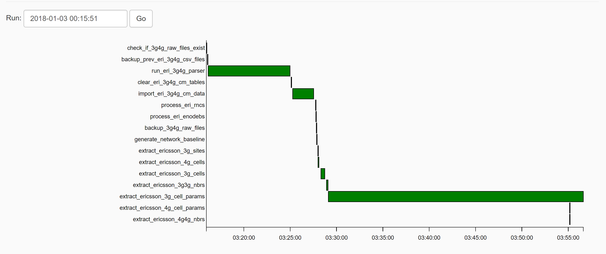

Mediation
============================= 
One of the biggest challenges we have had to address is how to handle the many complex depend data pipelines/workflows 
necessary to load data into the database, transform it, and perform other domain specific processing. 

Rather than re-invent the wheel we carefully surveyed the available open source data pipeline and ETL tools. We narrowed down on Apache's `Airflow <http://airflow.apache.org>`_ project
started at Airbnb. What it does is pure magic! Below is a sample of the Ericsson 3g4g ETL process defined as a DAG(Directed Acyclic Graph) in Airflow. Each dependency is clearly defined and easy to track.

The next figure below shows the duration of the entire process with the time each sub- task took displayed in a Gantt chart. Identifying which process is the bottleneck become a trivial task.

